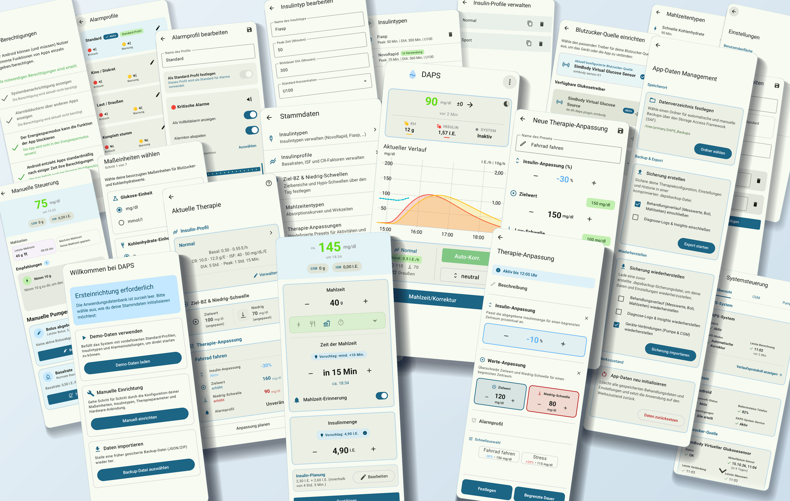
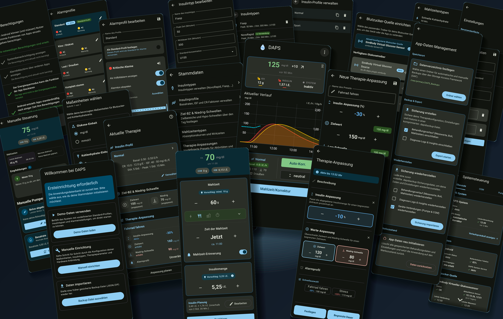

# DAPS — Your Diabetes, Your Control, Your Freedom! 🚀

[[Deutsche Version]](#deutsch)

## 🌟 Your therapy, as flexible as your life

**DAPS** (Automated Insulin Delivery / APS) was created to give you back **maximum freedom and full control** over your diabetes management. No rigid constraints, no complicated detours — just a modern, intelligent system that smoothly adapts to *your* daily life.

Whether in everyday routines, during sports, for a spontaneous snack, or at night: DAPS supports you right where you need it, remaining remarkably simple and intuitive.

Some screenshots:


And in dark theme:


---

> [!WARNING]
> **Experimental software — not a medical device.**
>
> DAPS is under active development and is open-source software. Use it at your own risk. Do not rely exclusively on this app for medical decisions or insulin dosing. Always verify medical decisions using your manufacturers' official devices.

---

## ✨ What makes DAPS special

### 📊 Clear & Everything at a glance
A **modern, clean dashboard** shows you exactly what matters in seconds: your current glucose values, trends, active insulin (IOB), active carbohydrates (COB), and loop status. No searching, no clutter — just clear and easy to understand.

### ⚙️ Maximum freedom in settings
Your diabetes is as individual as you are. DAPS offers **countless customization options** to tune target ranges, basal rates, factors, and algorithms precisely to your personal needs. You can flexibly **override individual values on the fly** or configure complete **presets** for specific life situations like sports, illness, or stress. You stay in full control at all times.

### 💡 Simple & Self-explanatory
No long learning curve required! The user interface is built from the ground up so that you can **find your way around immediately**. Clear icons, understandable dialogs, and a well-thought-out operating concept make daily use child's play.

### 🔍 Full transparency & Maximum data insight
No black box! DAPS provides **all key data clearly**: from current blood glucose values, active insulin (IOB), and active carbohydrates (COB) to exact meal and insulin action curves and a **detailed log**. Every decision made by the algorithm remains transparent and comprehensible for you at all times.

### 🍽️ Flexible meal declaration
Quick snack, multi-course meal, or high-fat/high-protein food? Record your meals exactly the way it suits you best. The **flexible entry system** makes carbohydrate tracking straightforward and extremely adaptable.

### 💉 Intelligent insulin planning
Plan boluses and meals ahead of time! With integrated **insulin planning**, DAPS calculates precise suggestions, takes activity profiles into account, and helps you effectively cushion meal spikes — even for tricky situations like pizza, baked cheese, meat, etc.

### 🔌 Easy CGM & Pump connection
DAPS relies on a modular system: To connect new CGM systems and insulin pumps, only a **very simple Kotlin interface** needs to be implemented. Development and integration of real hardware drivers is currently actively underway. Want to participate and contribute your own CGM or pump driver? Feel free to reach out!

### ⚡ High-performance & Modern
DAPS is a true **greenfield development** based on the latest Android technologies (Kotlin & Jetpack Compose). That means lightning-fast responsiveness, minimal battery consumption, and smooth animations — in elegant Light and Dark mode.

---

## 🚀 For Developers & The Curious

Want to try out DAPS or help shape it? The project relies on a **modern, modular architecture** with strict separation between core engine, CGM interfaces, and pump integration.

### 🛠️ Quickstart

1. Clone repository:
   ```bash
   git clone https://github.com/Albert78/DAPS.git
   ```
2. Open project in **Android Studio**.
3. Run directly on your Android smartphone (use the `simDebug` flavor for the integrated body simulator!).

*Note: Major updates may require clearing local app data (App Info ➔ Storage ➔ Clear Data).*

### 🧪 Integrated Body Simulator (`sim-body`)
Test algorithms, meals, and reactions safely without hardware! Simply build the app in the `simDebug` build flavor and simulate glucose curves, sports, or stress directly on your phone.

### 🧱 Tech Stack
* **Language:** Kotlin
* **UI & Navigation:** Jetpack Compose & Navigation 3
* **Reactivity:** Kotlin Coroutines & Flow
* **Persistence:** Room Database
* **Background:** Optimized Android Foreground Services

### UI & Localization
The user interface is currently only localized in German and is optimized for the Samsung Galaxy S26.

---

## 📄 License

This project is licensed under the [MIT License](LICENSE).

---

<a id="deutsch"></a>
# DAPS (Deutsche Version) — Dein Diabetes, deine Kontrolle, deine Freiheit! 🚀

> [!WARNING]
> **Experimentelle Software — kein Medizinprodukt.**
>
> DAPS befindet sich in aktiver Entwicklung und ist eine Open-Source-Software. Die Nutzung erfolgt auf eigene Gefahr. Verlasse dich nicht ausschließlich auf diese App für medizinische Entscheidungen oder Insulindosierungen. Überprüfe wichtige medizinische Entscheidungen stets mit den offiziellen Geräten deiner Hersteller.

---

## 🌟 Deine Therapie, exakt so flexibel wie dein Leben

**DAPS** (Automated Insulin Delivery / APS) wurde entwickelt, um dir die **maximale Freiheit und volle Kontrolle** über dein Diabetes-Management zurückzugeben. Kein starres Korsett, keine komplizierten Umwege – sondern ein modernes, intelligentes System, das sich geschmeidig an *deinen* Alltag anpasst.

Egal ob im Alltag, beim Sport, beim spontanen Snack zwischendurch oder in der Nacht: DAPS unterstützt dich genau dort, wo du es brauchst, und bleibt dabei erstaunlich einfach und intuitiv.

---

## ✨ Das macht DAPS so besonders

### 📊 Übersichtlich & Alles auf einen Blick
Ein **modernes, aufgeräumtes Dashboard** zeigt dir sekundenschnell genau das, was jetzt zählt: deine aktuellen Glukosewerte, Trends, aktives Insulin (IOB), aktive Kohlenhydrate (COB) und den Status deines Loops. Kein Suchen, kein Überladen – einfach klar und verständlich.

### ⚙️ Maximale Freiheit bei den Einstellungen
Dein Diabetes ist so individuell wie du. DAPS bietet dir **unzählige Einstellmöglichkeiten**, um Zielbereiche, Basalraten, Faktoren und Algorithmen exakt auf deine persönlichen Bedürfnisse abzustimmen. Du kannst flexibel **einzelne Werte spontan übersteuern** oder komplette **Presets** für bestimmte Lebenssituationen wie Sport, Krankheit oder Stress konfigurieren. Du behältst jederzeit das Steuer in der Hand.

### 💡 Einfach & Selbsterklärend
Kein langes Einarbeiten nötig! Die Benutzeroberfläche ist von Grund auf so gestaltet, dass du dich **sofort zurechtfindest**. Klare Icons, verständliche Dialoge und ein durchdachtes Bedienkonzept machen die tägliche Nutzung spielend leicht.

### 🔍 Volle Transparenz & Maximale Dateneinsicht
Keine Blackbox! DAPS stellt dir **alle wichtigen Daten übersichtlich bereit**: von aktuellen Blutzuckerwerten, aktivem Insulin (IOB) und aktiven Kohlenhydraten (COB) über die exakte Mahlzeiten- und Insulin-Wirkung bis hin zu einem **detaillierten Log**. Jede Entscheidung des Algorithmus bleibt dadurch für dich jederzeit transparent und nachvollziehbar.

### 🍽️ Flexible Mahlzeitendeklaration
Schneller Snack, ausgiebiges Menü oder fett- und eiweißreiche Speisen? Erfasse deine Mahlzeiten genau so, wie es für dich am besten passt. Die **flexible Eingabe** macht die Erfassung von Kohlenhydraten unkompliziert und extrem anpassungsfähig.

### 💉 Intelligente Insulinplanung
Plane Bolusgaben und Mahlzeiten voraus! Mit der integrierten **Insulinplanung** berechnet DAPS präzise Vorschläge, berücksichtigt Wirkprofile und hilft dir, Mahlzeiten-Spitzen effektiv abzufangen. Auch für schwierige Situationen wie Pizza, Ofenkäse, Fleisch etc.

### 🔌 Einfache Anbindung von CGM & Pumpen
DAPS setzt auf ein modulares System: Zur Anbindung neuer CGM-Systeme und Insulinpumpen muss lediglich ein **sehr einfaches Kotlin-Interface** implementiert werden. Die Entwicklung und Einbindung echter Hardware-Treiber ist derzeit aktiv im Gange. Du möchtest mitmachen und einen eigenen CGM- oder Pumpentreiber beisteuern? Melde dich gerne!

### ⚡ Hochperformant & Modern
DAPS ist eine echte **Greenfield-Entwicklung** auf Basis neuester Android-Technologien (Kotlin & Jetpack Compose). Das bedeutet: blitzschnelle Reaktionen, minimaler Akkuverbrauch und flüssige Animationen – im eleganten Light- und Dark-Mode.

---

## 🚀 Für Entwickler & Neugierige

Du möchtest DAPS ausprobieren oder mitgestalten? Das Projekt setzt auf eine **moderne, modulare Architektur** mit strikter Trennung von Core-Engine, CGM-Schnittstellen und Pumpen-Anbindung.

### 🛠️ Quickstart

1. Repository klonen:
   ```bash
   git clone https://github.com/Albert78/DAPS.git
   ```
2. Projekt in **Android Studio** öffnen.
3. Direkt auf deinem Android-Smartphone ausführen (`simDebug`-Flavor für den integrierten Körper-Simulator nutzen!).

*Hinweis: Bei großen Updates kann ein Löschen der lokalen App-Daten erforderlich sein (App-Info ➔ Speicher ➔ Daten löschen).*

### 🧪 Integrierter Körper-Simulator (`sim-body`)
Teste Algorithmen, Mahlzeiten und Reaktionen gefahrlos ohne Hardware! Bau einfach die App im `simDebug`-Build-Flavor und simuliere Glukoseverläufe, Sport oder Stress direkt auf dem Handy.

### 🧱 Tech Stack
* **Sprache:** Kotlin
* **UI & Navigation:** Jetpack Compose & Navigation 3
* **Reaktivität:** Kotlin Coroutines & Flow
* **Persistenz:** Room Database
* **Hintergrund:** Optimierte Android Foreground Services

### Hinweis zu UI & Lokalisierung
Die Benutzeroberfläche ist aktuell nur auf Deutsch lokalisiert und auf das Samsung Galaxy S26 optimiert.

---

## 📄 Lizenz

Dieses Projekt steht unter der [MIT-Lizenz](LICENSE).
